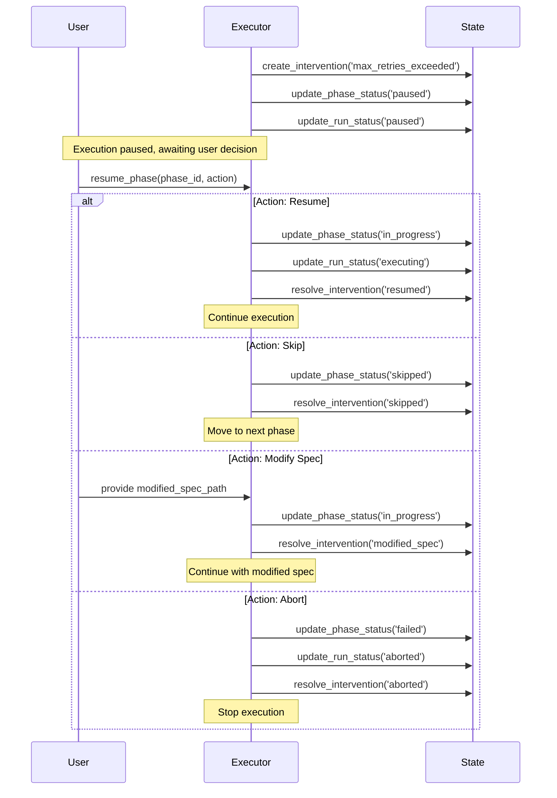
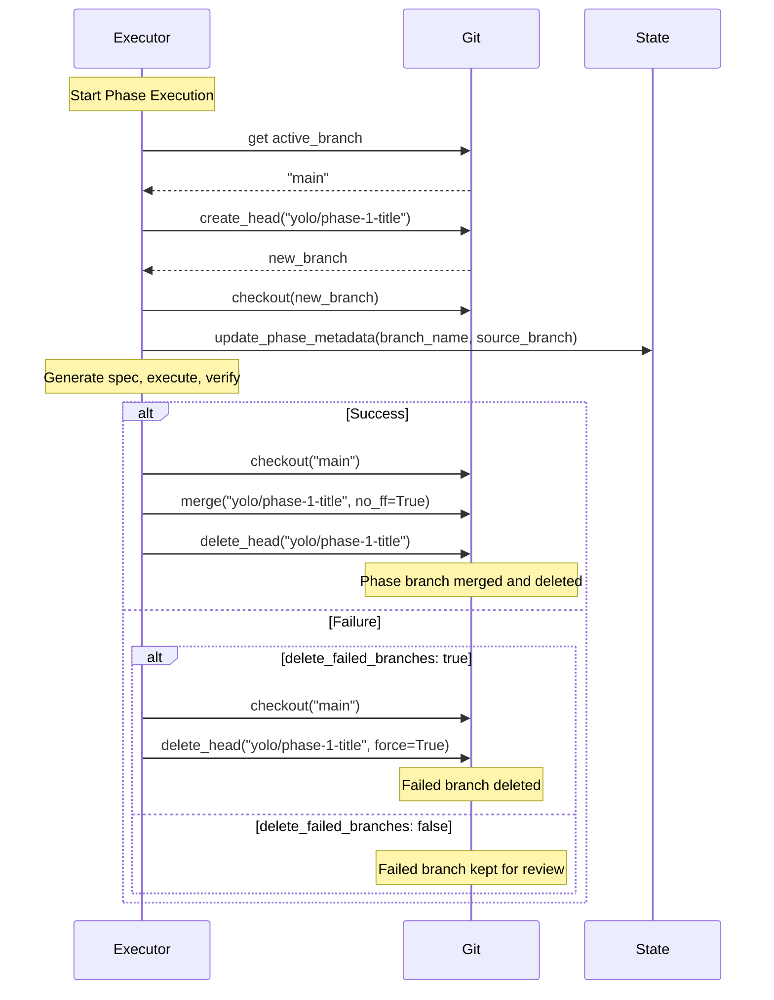

# Phase Executor Documentation

## Overview

The Phase Executor is the core orchestration engine for YOLO mode execution. It manages the lifecycle of approved phases, coordinating specification generation, retry logic, branch management, and manual intervention workflows.

## Architecture

### Components

```
PhaseExecutor
├── Configuration Management
├── Specification Generation
├── Retry Loop Orchestration
├── Branch Management (Git)
├── Manual Intervention Handling
├── Error Recovery
└── Progress Tracking
```

### Dependencies

- **StateManager**: Persists execution state to SQLite
- **LLM Client**: Generates enhanced specifications
- **RAG System**: Retrieves relevant code context
- **Git Repository**: Manages branch-per-phase workflow
- **Jinja2**: Templates phase specifications

## Phase Execution Lifecycle

### State Transitions

```
pending → in_progress → completed
                     ↓
                   failed
                     ↓
                   paused (manual intervention)
                     ↓
                   resumed/skipped/aborted
```

### Lifecycle Stages

1. **Initialization**
   - Load phase from state manager
   - Update status to 'in_progress'
   - Record start timestamp

2. **Branch Creation** (if branch mode)
   - Generate branch name: `{prefix}phase-{number}-{sanitized-title}`
   - Create and checkout branch
   - Store branch metadata

3. **Retry Loop** (1 to max_retries)
   - Generate detailed specification
   - Render Copilot prompt with spec and context
   - Invoke GitHub Copilot CLI for implementation
   - Capture and parse Copilot output
   - Save artifacts (prompt, output, logs)
   - Commit changes (if branch mode)
   - Verification happens next (external to executor)
   - Continue or retry based on results

4. **Manual Intervention** (if max_retries exceeded)
   - Create intervention record
   - Pause phase and run
   - Wait for user action
   - Resume based on action

5. **Completion**
   - Update phase status
   - Merge branch (if branch mode and successful)
   - Record completion timestamp

## Specification Generation

### Process

1. **Load Phase Data**
   - Parse `plan_json` for phase details
   - Extract title, intent, files, acceptance criteria, risks

2. **Retrieve Context**
   - Query RAG system with phase information
   - Get relevant code chunks (top 10)
   - Retrieve hot files (top 5)

3. **Render Template**
   - Use `phase_spec.md.j2` template
   - Include all phase details
   - Embed repository context

4. **LLM Enhancement** (optional)
   - Send spec + context to LLM
   - Request implementation details
   - Merge enhanced content

5. **Save Artifact**
   - Create directory: `artifacts/{run_id}/{phase_id}/pass_{n}/`
   - Save as `spec.md`
   - Register with state manager

### Specification Structure

```markdown
# Phase {N}: {Title}

## Overview
- Phase number, title, intent, size, pass number

## Goals
- High-level objectives

## Constraints
- Technical constraints
- Dependencies
- Repository conventions

## Implementation Steps
- Detailed step-by-step instructions

## Files to Modify
- List of files with descriptions

## Edge Cases
- Potential edge cases and handling

## Testing Requirements
- Tests to add/update
- Test scenarios

## Repository Context
- Code snippets from RAG
- Hot files
- Related context

## Acceptance Criteria
- Checklist of criteria

## Risks and Mitigation
- Known risks and strategies
```

## Retry Loop Mechanics

### Configuration

```yaml
execution:
  max_retries: 3  # Number of attempts per phase
```

### Loop Logic

```python
for pass_number in range(1, max_retries + 1):
    try:
        # Generate specification
        spec_path = generate_phase_spec(phase_id, pass_number)
        
        # Invoke GitHub Copilot CLI
        copilot_result = execute_with_copilot(phase_id, spec_path, pass_number)
        
        if not copilot_result.success:
            # Retry on Copilot failure
            if pass_number < max_retries:
                continue
            else:
                handle_manual_intervention(phase_id)
                break
        
        # Verification happens next (external)
        if verification_passed:
            break  # Exit loop
        else:
            if pass_number == max_retries:
                handle_manual_intervention(phase_id)
            else:
                continue  # Next pass with findings
    except Exception as e:
        handle_execution_error(phase_id, e)
        if pass_number == max_retries:
            handle_manual_intervention(phase_id)
```

### Pass Tracking

Each pass creates a new artifact directory with all execution artifacts:
```
artifacts/
  {run_id}/
    {phase_id}/
      pass_1/
        spec.md                # Phase specification
        copilot_prompt.md      # Prompt sent to Copilot
        copilot_output.json    # Parsed Copilot response
        copilot_raw.txt        # Raw CLI output
        error.log              # Error details (if failed)
      pass_2/
        spec.md
        copilot_prompt.md
        copilot_output.json
        copilot_raw.txt
      pass_3/
        spec.md
        copilot_prompt.md
        copilot_output.json
        copilot_raw.txt
```

## Copilot CLI Integration

### Execution Flow

1. **Render Prompt**
   - Load `copilot_prompt.md.j2` template
   - Include phase spec, findings (if retry), context
   - Save prompt to artifact directory

2. **Create Execution Record**
   - Store execution attempt in database
   - Track pass number, timestamps, status

3. **Invoke Copilot**
   - Execute: `gh copilot suggest --target shell`
   - Send prompt as stdin
   - Capture stdout/stderr with timeout
   - Parse JSON output

4. **Process Results**
   - Save `copilot_output.json`
   - Save `copilot_raw.txt` (if capture enabled)
   - Update execution record
   - Register all artifacts

5. **Commit Changes** (Branch Mode)
   - Stage all modified files
   - Create commit with formatted message
   - Optionally push to remote

### Configuration

```yaml
copilot:
  enabled: true
  cli_path: "gh"
  timeout: 600
  validate_on_startup: true
  capture_raw_output: true
  auto_commit: true
  commit_message_template: "Phase {phase_number}: {phase_title}\n\n{copilot_summary}"
  push_branches: false
  retry_on_timeout: true
  max_output_size_mb: 10
```

### Error Handling

**Timeout:**
- Process killed after timeout
- Partial output saved
- Retry attempted (if configured)

**CLI Not Found:**
- Error with installation instructions
- No retry (requires manual fix)

**Authentication Error:**
- Error with re-auth instructions
- No retry (requires manual fix)

**Malformed JSON:**
- Fallback to raw text parsing
- Retry attempted

**Execution Error:**
- stderr captured and logged
- Retry attempted

See [COPILOT_INTEGRATION.md](COPILOT_INTEGRATION.md) for complete details.

## Manual Intervention Workflow

### Trigger Conditions

- Max retries exceeded
- Critical error requiring user input

### Intervention Record

```python
{
    "id": "intervention_123",
    "run_id": "run_456",
    "phase_id": "phase_789",
    "reason": "max_retries_exceeded",
    "status": "pending",
    "created_at": "2024-01-01T00:00:00Z",
    "context": {
        "phase_number": 3,
        "phase_title": "Implement API endpoint",
        "max_retries": 3
    }
}
```

### User Actions

1. **Resume**: Continue from current state
   - Status: in_progress
   - Continues execution loop

2. **Skip**: Skip this phase
   - Status: skipped
   - Moves to next phase

3. **Modify Spec**: Update specification and retry
   - Status: in_progress
   - User provides modified spec path
   - Continues with modified spec

4. **Abort**: Stop execution
   - Status: failed
   - Run status: aborted
   - Execution stops

### Resolution

```python
await executor.resume_phase(
    phase_id="phase_789",
    action="resume",  # or "skip", "modify_spec", "abort"
    modified_spec_path="/path/to/spec.md"  # if action is "modify_spec"
)
```

## Branch Management

### Direct Mode

```yaml
execution:
  copilot_mode: "direct"
```

- No branches created
- All changes on current branch
- Faster execution
- Suitable for trusted workflows

### Branch-Per-Phase Mode

```yaml
execution:
  copilot_mode: "branch"
  branch_prefix: "yolo/"
```

- Each phase gets its own branch
- Branch name: `{prefix}phase-{number}-{sanitized-title}`
- Example: `yolo/phase-1-implement-auth`

### Branch Lifecycle

1. **Creation**
   ```python
   branch_name = f"{prefix}phase-{phase_number}-{sanitized_title}"
   new_branch = repo.create_head(branch_name)
   new_branch.checkout()
   ```

2. **Execution**
   - All changes happen on phase branch
   - Isolated from other phases

3. **Merge** (on success)
   ```python
   repo.git.checkout(source_branch)
   repo.git.merge(branch_name, no_ff=True)
   repo.delete_head(branch_name)
   ```

4. **Cleanup** (on failure)
   - Optionally delete failed branch
   - Or keep for manual review
   - Configurable via `delete_failed_branches`

## Integration Points

### Copilot CLI Integration (Future)

The executor generates specifications and returns control. Copilot execution will be handled by a separate module that:

1. Reads the generated `spec.md`
2. Invokes GitHub Copilot CLI
3. Monitors execution
4. Returns results to executor

### Verification Integration (Future)

After Copilot execution, a verifier module will:

1. Run tests
2. Check acceptance criteria
3. Analyze changes
4. Return pass/fail to executor

### Current State

For this phase, the executor:
- Generates specifications
- Returns `True` to simulate success
- Placeholder for future integration

## Error Handling and Recovery

### Error Types

1. **Specification Generation Errors**
   - RAG system failures
   - Template rendering errors
   - File system errors

2. **Git Operation Errors**
   - Branch creation failures
   - Merge conflicts
   - Repository access issues

3. **State Management Errors**
   - Database connection failures
   - Invalid state transitions

### Error Handling Strategy

```python
try:
    spec_path = await generate_phase_spec(phase_id, pass_number)
except Exception as e:
    logger.error(f"Error: {e}", exc_info=True)
    await handle_execution_error(phase_id, e)
    # Retry or escalate based on pass_number
```

### Error Artifacts

Errors are logged to `artifacts/{run_id}/{phase_id}/error.log`:

```
Error: Connection timeout
Type: TimeoutError
Timestamp: 2024-01-01T00:00:00Z

Traceback:
...
```

### Recovery Mechanisms

1. **Automatic Recovery**
   - Retry on transient errors
   - Up to `max_retries` attempts

2. **Manual Recovery**
   - Detect interrupted runs
   - Find recovery point (in_progress or paused phase)
   - Allow resumption

3. **State Recovery**
   ```python
   recovery_phase_id = await executor.recover_execution(run_id)
   if recovery_phase_id:
       await executor.execute_single_phase(recovery_phase_id)
   ```

## Configuration Options

### Execution Settings

```yaml
execution:
  max_retries: 3              # Number of attempts per phase
  copilot_mode: "branch"      # "direct" or "branch"
  branch_prefix: "yolo/"      # Prefix for phase branches
  delete_failed_branches: false  # Delete branches on failure
```

### Path Settings

```yaml
paths:
  artifact_base_path: "data/artifacts"  # Base directory for artifacts
  vector_db_path: "data/vector_db"      # RAG system database
```

### LLM Settings

```yaml
llm:
  host: "http://localhost:11434"
  model: "llama2"
  temperature: 0.7
  max_tokens: 4000
  embedding_model: "nomic-embed-text"
```

## Sequence Diagrams

### Normal Phase Execution

```mermaid
sequenceDiagram
    participant Executor
    participant State
    participant RAG
    participant LLM
    participant Git
    participant FS
    
    Executor->>State: get_phase(phase_id)
    State-->>Executor: PhaseState
    
    Executor->>State: update_phase_status('in_progress')
    
    alt Branch Mode
        Executor->>Git: create_branch(phase_name)
        Git-->>Executor: branch_name
    end
    
    loop Pass 1 to max_retries
        Executor->>RAG: retrieve_context(query)
        RAG-->>Executor: code chunks
        
        Executor->>LLM: enhance_spec(context)
        LLM-->>Executor: enhanced_spec
        
        Executor->>FS: save spec.md
        Executor->>State: register_artifact()
        
        Note over Executor: Return True (success)
        break Success
    end
    
    Executor->>State: update_phase_status('completed')
    
    alt Branch Mode
        Executor->>Git: merge_branch()
        Executor->>Git: delete_branch()
    end
```

### Retry Loop with Verification Failures

```mermaid
sequenceDiagram
    participant Executor
    participant State
    participant Verifier
    
    loop Pass 1 to max_retries
        Executor->>Executor: generate_phase_spec()
        
        Note over Executor: Copilot execution (future)
        Note over Executor: Verification (future)
        
        alt Verification Passed
            Executor->>State: update_phase_status('completed')
            break Exit loop
        else Verification Failed
            alt Max retries reached
                Executor->>State: create_intervention()
                Executor->>State: update_phase_status('paused')
                Note over Executor: Wait for user action
            else Continue
                Note over Executor: Increment pass_number
            end
        end
    end
```

### Manual Intervention Flow



### Branch-Per-Phase Workflow



## Usage Examples

### Basic Execution

```python
from orchestrator.executor import PhaseExecutor

executor = PhaseExecutor(
    config=config,
    llm_client=llm_client,
    rag_system=rag_system,
    state_manager=state_manager,
    repo_path="/path/to/repo"
)

# Execute all phases for a run
await executor.execute_phases(run_id="run_123")
```

### Single Phase Execution

```python
# Execute a specific phase
success = await executor.execute_single_phase(phase_id="phase_456")
if not success:
    print("Phase execution failed or requires intervention")
```

### Manual Intervention Handling

```python
# Check for interventions
interventions = state_manager.get_interventions_for_phase(phase_id)
active = next((i for i in interventions if i.status == 'pending'), None)

if active:
    # Resume execution
    await executor.resume_phase(
        phase_id=phase_id,
        action="resume"
    )
    
    # Or skip the phase
    await executor.resume_phase(
        phase_id=phase_id,
        action="skip"
    )
```

### Recovery from Interruption

```python
# Find recovery point
recovery_phase_id = await executor.recover_execution(run_id="run_123")

if recovery_phase_id:
    print(f"Recovering from phase {recovery_phase_id}")
    await executor.execute_single_phase(recovery_phase_id)
else:
    print("No recovery needed")
```

### Execution Summary

```python
# Generate summary after execution
summary = await executor.generate_execution_summary(run_id="run_123")

print(f"Total Phases: {summary['total_phases']}")
print(f"Completed: {summary['completed']}")
print(f"Failed: {summary['failed']}")
print(f"Skipped: {summary['skipped']}")
```

### Standalone Execution

```python
from orchestrator.executor import execute_run_standalone

# For testing purposes
await execute_run_standalone(
    run_id="run_123",
    config_path="config/orchestrator-config.yaml",
    db_path="data/orchestrator.db"
)
```

## Best Practices

### Configuration

1. **Set appropriate max_retries**
   - Small phases: 2-3 retries
   - Medium phases: 3-5 retries
   - Large phases: 5-7 retries

2. **Choose execution mode wisely**
   - Use `direct` for trusted, simple workflows
   - Use `branch` for complex changes requiring isolation

3. **Configure branch cleanup**
   - Delete failed branches in automated pipelines
   - Keep failed branches for manual debugging

### Error Handling

1. **Monitor error logs**
   - Check `artifacts/{run_id}/{phase_id}/error.log`
   - Investigate patterns in failures

2. **Use manual intervention**
   - Review failed phases before resuming
   - Modify specs based on learnings

3. **Implement recovery procedures**
   - Always check for recovery points on restart
   - Use `recover_execution()` before starting new runs

### Performance

1. **Optimize RAG queries**
   - Keep queries focused and specific
   - Limit top_k to reasonable numbers (10-15)

2. **Use LLM enhancement selectively**
   - Enable for complex phases
   - Disable for simple, well-defined phases

3. **Monitor resource usage**
   - Track artifact directory size
   - Clean up old runs periodically

## Testing

See `tests/test_executor.py` for comprehensive test suite covering:

- Configuration validation
- Spec generation (with and without context)
- Phase execution (success and failure)
- Retry loop logic
- Branch management
- Manual intervention workflows
- Error handling and recovery
- Progress tracking

## Future Enhancements

### Planned Integrations

1. **Copilot CLI Integration**
   - Direct invocation of GitHub Copilot
   - Real-time execution monitoring
   - Diff capture and analysis

2. **Verification System**
   - Automated test running
   - Acceptance criteria checking
   - Quality metrics calculation

3. **Findings Analysis**
   - Parse Copilot output
   - Categorize issues
   - Threshold-based decision making

### Feature Roadmap

1. **Parallel Phase Execution**
   - Execute independent phases concurrently
   - Respect dependency ordering
   - Optimize for throughput

2. **Advanced Recovery**
   - Checkpoint intermediate states
   - Rollback on critical failures
   - Partial phase resumption

3. **Enhanced Monitoring**
   - Real-time progress dashboard
   - Webhook notifications
   - Metrics collection and analysis

4. **Adaptive Retry Strategy**
   - Dynamic max_retries based on phase complexity
   - Exponential backoff on transient errors
   - Smart failure analysis

## Troubleshooting

### Common Issues

1. **Spec generation fails**
   - Check RAG system connectivity
   - Verify template files exist
   - Ensure artifact directory is writable

2. **Branch operations fail**
   - Verify Git repository is initialized
   - Check for uncommitted changes
   - Ensure branch names are valid

3. **State updates fail**
   - Check database connectivity
   - Verify schema is up to date
   - Ensure proper transaction handling

4. **LLM enhancement timeout**
   - Increase timeout settings
   - Reduce context size
   - Fallback to non-enhanced specs

### Debug Mode

Enable debug logging:

```python
import logging
logging.basicConfig(level=logging.DEBUG)
```

### Support

For issues or questions:
- Check logs in `data/logs/`
- Review error artifacts in `data/artifacts/`
- Consult state database for execution history
