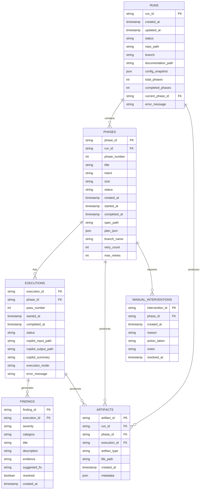
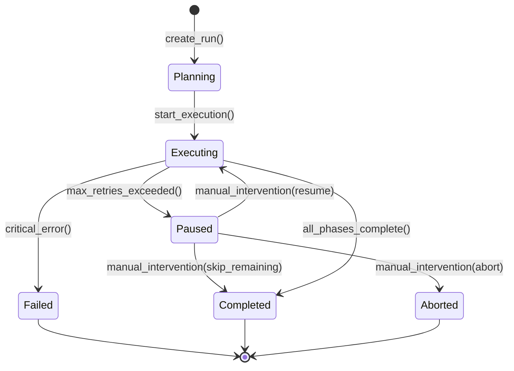
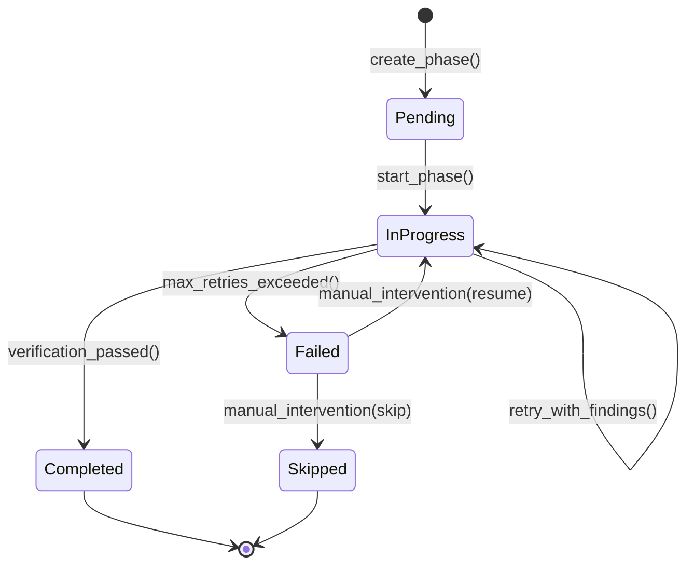

# State Management

## Overview

The Agent Orchestrator uses a robust state management system built on SQLite to track all orchestration activities. This system provides persistence, recovery capabilities, and comprehensive audit trails for all operations.

## Architecture



## State Transitions

### Run State Transitions



### Phase State Transitions



## Usage Examples

### Basic State Management

```python
from orchestrator import StateManager

async def example_run():
    async with StateManager("data/orchestrator.db", "data/artifacts") as sm:
        # Create a new run
        run = await sm.create_run(
            repo_path="/path/to/repo",
            branch="main",
            doc_path="/path/to/doc.md",
            config={"max_retries": 3}
        )
        
        # Create phases
        phase = await sm.create_phase(
            run_id=run.run_id,
            phase_number=1,
            title="Setup Database",
            intent="Create initial database schema",
            plan={
                "files": ["schema.sql", "migrations/001_initial.sql"],
                "acceptance_criteria": ["Schema created", "Migrations run"],
                "dependencies": [],
                "risks": ["Database connection issues"]
            },
            max_retries=3
        )
        
        # Update phase status
        await sm.update_phase_status(
            phase.phase_id,
            "in_progress",
            started_at=datetime.now()
        )
        
        # Create execution
        execution = await sm.create_execution(
            phase_id=phase.phase_id,
            pass_number=1,
            copilot_input_path="artifacts/phase1_spec.md",
            execution_mode="direct"
        )
        
        # Add findings
        finding = await sm.add_finding(
            execution_id=execution.execution_id,
            severity="minor",
            category="lint",
            title="Missing docstring",
            description="Function 'create_schema' is missing a docstring",
            evidence="schema.py:15",
            suggested_fix="Add docstring explaining function purpose"
        )
        
        # Complete execution
        await sm.complete_execution(
            execution.execution_id,
            copilot_output_path="artifacts/copilot_output.json",
            copilot_summary="Successfully created schema"
        )
```

### Recovery Workflow

```python
async def recover_interrupted_run():
    async with StateManager("data/orchestrator.db", "data/artifacts") as sm:
        # Get recoverable runs
        recoverable = await sm.get_recoverable_runs()
        
        if recoverable:
            run_id = recoverable[0].run_id
            run, current_phase = await sm.recover_run(run_id)
            
            print(f"Recovering run {run_id}")
            print(f"Current phase: {current_phase.title if current_phase else 'None'}")
            
            # Resume execution or handle manual intervention
            if current_phase and current_phase.status == "failed":
                interventions = await sm.get_pending_interventions(run_id)
                if interventions:
                    print(f"Manual intervention required: {interventions[0].reason}")
```

### Export and Reporting

```python
async def generate_report():
    async with StateManager("data/orchestrator.db", "data/artifacts") as sm:
        # Export run to JSON
        await sm.export_run_to_json(
            run_id="abc-123",
            output_path="reports/run_abc-123.json"
        )
        
        # Get summary for reporting
        summary = await sm.export_run_summary("abc-123")
        
        print(f"Run Status: {summary.run.status}")
        print(f"Total Phases: {len(summary.phases)}")
        print(f"Executions: {summary.execution_count}")
        print(f"Findings: {summary.findings_summary}")
        
        # Export to markdown
        markdown = summary.to_markdown()
        with open("reports/summary.md", "w") as f:
            f.write(markdown)
```

## JSON Export Format

The state manager can export complete run data to JSON for portability and analysis:

```json
{
  "run": {
    "run_id": "abc-123",
    "status": "completed",
    "repo_path": "/path/to/repo",
    "branch": "main",
    "created_at": "2025-01-01T10:00:00",
    "total_phases": 5,
    "completed_phases": 5
  },
  "phases": [
    {
      "phase": {
        "phase_id": "phase-1",
        "phase_number": 1,
        "title": "Setup Database",
        "status": "completed",
        "retry_count": 0
      },
      "executions": [
        {
          "execution": {
            "execution_id": "exec-1",
            "pass_number": 1,
            "status": "completed"
          },
          "findings": [
            {
              "severity": "minor",
              "category": "lint",
              "title": "Style issue",
              "resolved": true
            }
          ]
        }
      ]
    }
  ],
  "artifacts": [
    {
      "artifact_type": "spec",
      "file_path": "artifacts/abc-123/phase-1/spec.md"
    }
  ]
}
```

## Database Management

### Statistics

```python
async def get_db_stats():
    async with StateManager("data/orchestrator.db", "data/artifacts") as sm:
        stats = await sm.get_statistics()
        
        print(f"Total Runs: {stats['total_runs']}")
        print(f"Total Phases: {stats['total_phases']}")
        print(f"Findings by Severity: {stats['findings_by_severity']}")
```

### Optimization

```python
async def optimize_database():
    async with StateManager("data/orchestrator.db", "data/artifacts") as sm:
        await sm.vacuum_database()
```

## Error Handling

The state manager uses custom exceptions for better error handling:

```python
from orchestrator.exceptions import (
    RunNotFoundError,
    PhaseNotFoundError,
    DatabaseError
)

try:
    run = await sm.get_run("nonexistent-id")
    if not run:
        print("Run not found")
except DatabaseError as e:
    print(f"Database error: {e}")
```

## Best Practices

1. **Always use context manager**: Use `async with StateManager(...)` to ensure proper cleanup
2. **Handle recovery**: Check for recoverable runs on startup
3. **Export regularly**: Export run data periodically for backup
4. **Monitor findings**: Track findings by severity to identify patterns
5. **Clean up artifacts**: Use retention policies to manage disk space
6. **Use transactions**: State manager automatically handles transactions for consistency
